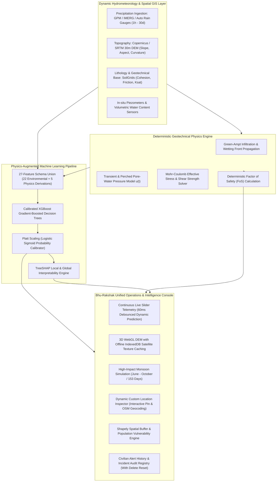

# Bhu-Rakshak (भू-रक्षक) — Complete System

**Physics-Informed Geotechnical Intelligence & Multi-Hazard Landslide Early-Warning System**  
*Autonomous Himalayan Corridor Monitoring | Sikkim Critical Highway Network (NH-10, SH-1, SH-2)*

[](https://www.python.org/downloads/)
[](https://fastapi.tiangolo.com/)
[](https://react.dev/)
[](https://threejs.org/)
[](https://xgboost.readthedocs.io/)
[](https://leafletjs.com/)
[](https://developer.mozilla.org/en-US/docs/Web/API/IndexedDB_API)

---

## 1. Executive Summary & Problem Context

The North Sikkim Himalayas represent one of the most tectonically active, geomorphically steep, and hydrometeorologically extreme mountainous terrains in the world. Vital arterial lifelines—most prominently the **National Highway 10 (NH-10)**, the **Mangan–Chungthang State Highway (SH-1)**, and the **Chungthang–Lachen / Chungthang–Lachung Corridors (SH-2)**—suffer recurrent, catastrophic slope collapses during the annual Indian Summer Monsoon (June to October). These slope failures repeatedly sever military border supply chains, isolate vulnerable mountain communities, and inflict tragic loss of life and critical infrastructure damage.

Traditional early-warning approaches typically fall into two flawed extremes:
1. **Purely empirical rainfall thresholds (I-D curves)**: Cause high false-alarm rates because they treat the mountain as a black box, completely ignoring subsurface pore-water pressure dynamics, soil cohesion, slope angle, and shearing resistance.
2. **Pure machine learning models**: Lack physical boundaries and can hallucinate unphysical predictions under out-of-distribution cloudburst events, making them unacceptable for mission-critical civil defense operations.

**Bhu-Rakshak (भू-रक्षक)** overcomes these limitations by pioneering a **Physics-Informed, Machine-Learning-Calibrated Early-Warning System**:
- **Deterministic Geotechnical Physics**: Implements the classical Infinite Slope Stability Model and Mohr-Coulomb failure criterion to evaluate instantaneous normal stress, pore-water pressure, and the geotechnical **Factor of Safety ($FoS$)**.
- **Physics-Augmented Machine Learning**: Couples physical stability features with 22 multi-source environmental, geomorphic, and hydrometeorological covariates into a calibrated **XGBoost** classification pipeline.
- **Single Unified Intelligence Console**: Provides disaster authorities with instant live slider telemetry, offline-capable 3D terrain Digital Elevation Models (DEM), multi-region monsoon simulations, dynamic custom location inspection, and a persistent audit trail of civilian early-warning advisories and historical incidents.

---

## 2. Core System Architecture

Bhu-Rakshak is engineered as a tightly integrated full-stack intelligence system:



---

## 3. Geotechnical Physics Engine: Mechanics & Mathematical Formulations

The physics core evaluates slope stability using the **Infinite Slope Model** under effective stress conditions, governed by the classical **Mohr-Coulomb Failure Criterion**.

### 3.1 Closed-Form Factor of Safety ($FoS$) Formulation

The Factor of Safety ($FoS$) represents the ratio between the available shear strength of the soil regolith ($\tau_f$) and the gravitational driving shear stress acting along the potential slip surface ($\tau_d$):

$$FoS = \frac{\tau_f}{\tau_d}$$

For a planar slip surface at depth $z$ parallel to a hillside slope inclined at angle $\theta$ (or $\beta$), with bulk unit weight $\gamma$ and pore-water pressure $u$:

#### 1. Mobilized Gravitational Driving Shear Stress
$$\tau_d = \gamma \cdot z \cdot \sin\theta \cdot \cos\theta$$

#### 2. Total Normal Stress on Slip Plane
$$\sigma_n = \gamma \cdot z \cdot \cos^2\theta$$

#### 3. Effective Normal Stress (Terzaghi Effective Stress Principle)
$$\sigma' = \sigma_n - u = (\gamma \cdot z \cdot \cos^2\theta) - u$$

#### 4. Resisting Shear Strength (Mohr-Coulomb Criterion)
$$\tau_f = c' + \sigma' \cdot \tan\phi' = c' + \max\left(0, \gamma \cdot z \cdot \cos^2\theta - u\right) \cdot \tan\phi'$$

#### 5. Complete Geotechnical Factor of Safety Equation
$$FoS = \frac{c' + \left(\gamma \cdot z \cdot \cos^2\theta - u\right)\tan\phi'}{\gamma \cdot z \cdot \sin\theta \cdot \cos\theta}$$

Where:
- $c'$: Effective soil cohesion ($\text{kPa}$)
- $\phi'$: Effective internal friction angle ($^\circ$)
- $\theta$: Slope inclination angle ($^\circ$)
- $\gamma$: Soil bulk unit weight ($\text{kN/m}^3$, calibrated to $\approx 19.0\ \text{kN/m}^3$ for Himalayan colluvium)
- $z$: Failure plane depth ($\text{m}$, representative depth $1.5\text{m} - 3.5\text{m}$)
- $u$: Dynamic pore-water pressure ($\text{kPa}$)

---

### 3.2 Infiltration & Transient Pore-Water Pressure Mechanics

Pore-water pressure $u$ is resolved dynamically through a two-regime hydrological infiltration solver:
1. **Wetting Front Depth Progression**:
   $$z_w(t) = \min\left(z_{\text{slip}}, \frac{I_{\text{cum}}(t)}{\theta_s - \theta_0}\right)$$
   Where $I_{\text{cum}}(t)$ is the cumulative infiltration calculated from antecedent 24h precipitation $R_{24}$ and saturated hydraulic conductivity $K_{\text{sat}}$, and $\theta_s - \theta_0$ is the regolith moisture deficit.
2. **Pore-Water Pressure Regime**:
   - **Pre-Saturation Stage ($z_w < z_{\text{slip}}$)**: Suction dominates or transient hydrostatic pressure is negligible ($u \approx 0$).
   - **Perched Groundwater Stage ($z_w \ge z_{\text{slip}}$)**: When infiltration reaches an impermeable or lower-conductivity bedrock boundary, a perched water table forms:
     $$u = \psi \cdot \gamma_w \cdot z \cdot \cos^2\theta$$
     Where $\gamma_w = 9.81\ \text{kN/m}^3$ and $\psi = \max(0, S_{\text{eff}} - 0.5)$ represents the mobilized excess saturation fraction.

---

### 3.3 Geotechnical Stability Classification Bands

| Factor of Safety ($FoS$) | Geotechnical Classification | Mechanical State | Standard Operational Directive |
| :--- | :--- | :--- | :--- |
| **$FoS \ge 1.50$** | **STABLE** | Resisting shear capacity exceeds driving forces by $\ge 50\%$. | Normal baseline monitoring; corridors green. |
| **$1.00 \le FoS < 1.50$** | **MARGINAL** | Slope is approaching plastic limit equilibrium under elevated pore pressure. | Yellow advisory; traffic caution; rescue staging. |
| **$FoS < 1.00$** | **UNSTABLE / IMMINENT FAILURE** | Gravitational shear overcomes resisting shear ($\tau_d > \tau_f$); catastrophic slope failure occurs. | Red emergency alert; immediate road closure; evacuation orders. |

---

## 4. Physics-Augmented Machine Learning Pipeline

### 4.1 27-Feature Authoritative Schema
The machine learning pipeline combines 22 environmental/geomorphological variables with 5 physics-derived features. Crucially, raw categorical identifiers (`location_id`) are excluded, forcing the model to learn generalizable geomechanical relationships rather than memorizing site locations:

| Category | Features | Source / Description |
| :--- | :--- | :--- |
| **Precipitation Triggers** | `rainfall_1h_mm`, `rainfall_3h_mm`, `rainfall_6h_mm`, `rainfall_12h_mm`, `rainfall_24h_mm`, `rainfall_72h_mm`, `rainfall_7d_mm`, `rainfall_30d_mm` | Satellite (GPM/IMERG) & rain gauge rainfall accumulations across short-burst and long-term antecedent windows. |
| **Topography & DEM** | `elevation_m`, `slope_deg`, `aspect_sin`, `aspect_cos`, `plan_curvature`, `profile_curvature`, `flow_accumulation_m2`, `distance_to_stream_m` | Derived from 30m Copernicus/SRTM DEM; captures terrain steepness, solar aspect, flow convergence, and river toe erosion. |
| **Soil & Lithology** | `clay_percent`, `sand_percent`, `silt_percent`, `bulk_density_kg_m3`, `ndvi_summary` | SoilGrids global datasets & satellite NDVI; captures soil texture, density, and root reinforcement from vegetation. |
| **Historical Proximity** | `nearest_historical_landslide_distance_m`, `historical_landslide_count_1km_5y`, `historical_landslide_count_5km_5y` | NRSC / ISRO Landslide Atlas historical spatial clustering. |
| **Physics-Informed Features** | `factor_of_safety`, `pore_pressure_kpa`, `effective_saturation_0_1`, `infiltration_rate_mm_h`, `cumulative_infiltration_mm` | Real-time outputs from the deterministic geotechnical physics engine. |

### 4.2 Model Training, Cross-Validation & Probability Calibration
- **Model**: `XGBClassifier` tuned with conservative hyper-parameters (max depth 4, learning rate 0.05, subsample ratio 0.85, colsample ratio 0.85) to avoid overfitting.
- **GroupKFold Spatial Cross-Validation**: Folds are split strictly across geographic spatial clusters to guarantee that validation evaluates performance on previously unseen mountain slopes.
- **Probability Calibration (Platt Scaling)**: Raw tree ensemble scores do not reflect true statistical failure frequencies. Bhu-Rakshak passes raw model outputs through a **Sigmoid Probability Calibrator** (`CalibratedClassifierCV`) fitted on a disjoint validation fold. A reported probability of $80\%$ strictly denotes that 80 out of 100 slopes under identical geotechnical conditions experience failure.

### 4.3 Explainable AI via TreeSHAP
For every single inference, the backend computes local SHAP (SHapley Additive exPlanations) values:

$$f(x) = \phi_0 + \sum_{i=1}^{M} \phi_i(x)$$

The operations dashboard renders these feature contributions in real-time waterfall charts, giving disaster commanders complete transparency into whether an alert was triggered by sudden 24h cloudburst accumulation, pore-water pressure escalation, steep slope angle, or degraded soil cohesion.

---

## 5. Key System Features & Innovations

### 5.1 Continuous Live Slider Telemetry (Instant Prediction)
- In the **Dashboard** panel, operators can dynamically adjust key geotechnical and meteorological parameters:
  - 24-Hour Rainfall ($0 - 400\ \text{mm}$)
  - Antecedent Soil Saturation ($0.05 - 1.00$)
  - Soil Cohesion ($5 - 50\ \text{kPa}$)
  - Slope Gradient ($15^\circ - 65^\circ$)
  - Internal Friction Angle ($15^\circ - 45^\circ$)
- **Zero-Click Live Recalculation**: Every slider change triggers an instantaneous, 60ms-debounced asynchronous request to `POST /api/simulate`.
- Results—including the updated Factor of Safety ($FoS$), Calibrated Failure Probability %, and stability gauge—update continuously as you drag the sliders, eliminating the need to click an "Apply" button.

---

### 5.2 3D Digital Elevation Model (DEM) with Offline Satellite Caching
- **WebGL Terrain Visualization**: Built with Three.js, rendering realistic 3D mountain topographies, elevation contours, failure slip-planes, and interactive OrbitControls (rotate, pan, zoom).
- **Persistent Offline Architecture (IndexedDB)**:
  - Field stations in North Sikkim (e.g. Lachen, Chungthang) frequently experience complete cellular and satellite internet outages during extreme monsoon storms.
  - When the machine is **Online**, high-resolution satellite imagery (Esri ArcGIS World Imagery) is fetched, rendered onto the 3D surface, and saved automatically into browser **IndexedDB** (`BhuRakshakTerrainDB` -> `satellite_textures`).
  - When the system opens in **Offline Mode** (or internet connectivity drops), the 3D engine immediately detects the offline state and loads the cached satellite texture from IndexedDB, ensuring zero downtime and fully offline 3D visualization.

---

### 5.3 High-Impact Monsoon Simulation Engine (June – October / 153 Days)
- Calibrated across the complete 153-day peak monsoon window (June 1 to October 31).
- **Playback Controls**:
  - Play / Pause / Step-Forward / Step-Backward.
  - Variable speed multiplier ($1\times$, $2\times$, $5\times$, $10\times$).
  - Synchronized Month and Day slider with live date telemetry.
- **Realistic Multi-Corridor Escalation Schedule**:
  - *Late June*: Soil saturation build-up along lower Teesta valley (Dikchu).
  - *Mid-July*: Severe cloudburst and slope collapse at Chungthang Hydel cut (94% failure probability; highway severed).
  - *Early August*: Upper Lachen valley debris torrents and culvert destruction.
  - *Late August*: Lachung flash flood surging and Singhik highway escarpment destabilization.
  - *September*: Regional Mangan transit bottleneck failure.

---

### 5.4 Dynamic Custom Location Inspection Tool
- Inside the **Simulation Data** tab, operators can click the **"+ Add Custom Location"** button.
- **Interactive Map Pin-Drop**: Click anywhere across the North Sikkim Himalayan terrain.
- **Automated Reverse Geocoding**: The backend queries OpenStreetMap (Nominatim) in real time to resolve actual Himalayan place names, administrative tehsils, and connecting road corridors.
- **On-the-Fly Geotechnical Synthesis**: Instantly extracts elevation, slope, and soil characteristics, runs the physics + ML early-warning pipeline, and displays the risk evaluation for the selected custom coordinate.

---

### 5.5 Unified Alert History & Incident Audit Console
- **Version 1 Phased Out**: Legacy manual SMS test dispatching and complex provider settings have been cleanly removed to provide a unified, production-ready incident management console.
- **Civilian-Friendly Advisories**: Dispatched alerts translate technical geotechnical metrics into actionable, life-saving civil directives:
  > *"CRITICAL WARNING: 88% probability of a catastrophic landslide along the road connecting Chungthang - Mangan Corridor (SH-1). Immediate action: Halt all vehicular traffic, stay clear of slope bases, and evacuate to designated high-ground shelters."*
- **Historical Landslide & Danger Tracking**: Permanently tracks historical baseline incidents (including the 2023 South Lhonak GLOF flash flood and 2024 monsoon debris flows) alongside active early-warning dispatches.
- **One-Click Audit Reset**: Includes a dedicated **"Delete History"** button connected to `DELETE /api/alerts/history` to easily clear demonstration alerts during field tests.

---

### 5.6 GIS Spatial Impact & Vulnerability Engine
- Integrated Shapely GIS engine executes multi-ring spatial buffering (1km, 2.5km, 5km) around high-risk failure zones.
- Computes threatened settlements, estimated exposed civilian populations, and exact road corridor segments severed.

---

## 6. Repository Layout

```
Bhu-Rakshak_Complete_System/
├── backend/                        # FastAPI REST service & application logic
│   ├── config.py                   # Centralized configuration & thresholds
│   ├── main.py                     # App lifespan, route registration & static mounts
│   ├── severity.py                 # Multi-factor severity scoring matrix
│   ├── routes/
│   │   ├── alerts.py               # Alert history & incident registry endpoints
│   │   ├── impact.py               # GIS buffer impact endpoints
│   │   ├── locations.py            # Monitored sites & active overrides
│   │   ├── predict.py              # Single-site real-time inference
│   │   ├── profile.py              # Unified console profile state
│   │   ├── settings.py             # System provider configurations
│   │   ├── simulate.py             # Scenario simulation & custom location inspection
│   │   └── train.py                # Model retraining background worker
│   └── models/
│       └── alert_history_store.py  # Persistent JSON audit store for alerts & incidents
├── physics/                        # Deterministic Geotechnical Physics Engine
│   ├── engine.py                   # Physics pipeline orchestration
│   ├── factor_of_safety.py         # Infinite slope Mohr-Coulomb FoS calculator
│   ├── infiltration.py             # Green-Ampt hydrologic infiltration solver
│   ├── pore_pressure.py            # Transient & perched pore-water pressure model
│   └── schemas.py                  # Dataclasses & schemas for geotechnical variables
├── ml/                             # Machine Learning Training & Inference Pipeline
│   ├── dataset.py                  # 27-feature dataset synthesis & augmentation
│   ├── feature_manifest.py         # Authoritative feature schema & leakage rules
│   ├── labels.py                   # 24h hazard horizon labeling functions
│   ├── split.py                    # GroupKFold geographic spatial cross-validation
│   └── train.py                    # XGBoost training, GridSearchCV & calibration
├── service/
│   └── prediction_service.py       # Thread-safe model runtime serving all locations
├── gis/                            # Geospatial Impact Engine
│   ├── impact_engine.py            # Shapely spatial buffer & road intersection
│   ├── seed_settlements.json       # North Sikkim village coordinates & populations
│   └── seed_roads.json             # Sikkim road vectors (NH-10, SH-1, SH-2, JN Road)
├── terrain3d/                      # 3D Digital Elevation Model generation
│   ├── fetch_dem.py                # Real DEM fetch script from OpenTopography
│   └── generate_synthetic_dem.py   # High-resolution synthetic mountain heightmap
├── frontend/                       # React 18 + Vite Web Application
│   ├── dist/                       # Production build (served directly by FastAPI)
│   ├── src/
│   │   ├── App.jsx                 # Unified 4-tab console layout
│   │   ├── state/
│   │   │   └── SiteStateContext.jsx# Reactive site selection & telemetry context
│   │   ├── components/
│   │   │   ├── SiteList.jsx        # Sidebar with 6 pilot Himalayan locations
│   │   │   ├── MainView.jsx        # Map / Terrain container & mode switchers
│   │   │   ├── MapView.jsx         # 2D Leaflet GIS interactive map
│   │   │   ├── Terrain3DView.jsx   # Three.js 3D DEM with offline satellite cache
│   │   │   ├── SitePanel.jsx       # Real-time live slider telemetry & SHAP display
│   │   │   ├── SimulationWorkspace.jsx # Monsoon timeline, playback & custom pin drop
│   │   │   ├── AlertHistoryPanel.jsx   # Civil alert audit log & historical incidents
│   │   │   └── TrainingPanel.jsx   # Model performance & live retraining console
│   │   └── utils/
│   │       └── satelliteStorage.js # IndexedDB engine for offline 3D satellite caching
├── data/                           # Data storage & state persistence
│   ├── alert_history.json          # Persistent log of dispatched civilian warnings
│   ├── incident_history.json       # Historical landslide records & benchmark events
│   ├── site_overrides.json         # Real-time telemetry slider state overrides
│   └── app_profile.json            # Active console configuration profile
├── artifacts/                      # Serialized ML models & metrics
│   ├── xgb_model.json              # Trained XGBoost classifier
│   ├── calibrator.joblib           # Sigmoid probability calibrator
│   └── metrics/                    # Training performance curves & confusion matrices
├── Start_Bhu-Rakshak.bat           # One-click launcher for Windows
├── Start_Bhu-Rakshak.command       # One-click launcher for macOS / Linux
└── requirements.txt                # Python backend dependencies
```

---

## 7. Quick Start Guide

### 7.1 One-Click Launchers (Recommended)

- **Windows**: Double-click `Start_Bhu-Rakshak.bat`.
- **macOS / Linux**: Double-click `Start_Bhu-Rakshak.command`. (First run: `chmod +x Start_Bhu-Rakshak.command`).

*The launcher automatically verifies dependencies, starts the FastAPI server on port 8731, and launches your browser to `http://127.0.0.1:8731`.*

---

### 7.2 Manual Installation & Startup

#### 1. Clone & Set Up Python Virtual Environment
```bash
git clone https://github.com/aritra15-06/Bhu-Rakshak.git
cd Bhu-Rakshak

python3 -m venv venv
# On Windows:
.\venv\Scripts\activate
# On macOS/Linux:
source venv/bin/activate
```

#### 2. Install Python Dependencies
```bash
pip install --force-reinstall --no-deps fastapi==0.110.0 starlette==0.36.3 "uvicorn[standard]==0.29.0"
pip install -r requirements.txt
```

#### 3. Build the React Frontend
```bash
cd frontend
npm install
npm run build
cd ..
```

#### 4. Launch the Server
```bash
python3 -m uvicorn backend.main:app --host 127.0.0.1 --port 8731
```
Open **`http://127.0.0.1:8731`** in any modern web browser.

---

## 8. REST API Reference

| HTTP Method | Endpoint | Description | Sample Request / Query |
| :--- | :--- | :--- | :--- |
| `GET` | `/api/health` | Healthcheck, model load state & server status. | None |
| `GET` | `/api/locations` | Returns all 6 monitored Himalayan pilot sites with live state. | None |
| `POST` | `/api/simulate` | Continuous live slider simulation (FoS + calibrated probability). | `{"location_id": "LOC01", "rainfall_24h_mm": 240, ...}` |
| `POST` | `/api/simulate/custom` | Geocodes clicked coordinates, infers parameters & predicts risk. | `{"lat": 27.61, "lon": 88.58, "rainfall_24h_mm": 180}` |
| `GET` | `/api/alerts/history` | Fetches all dispatched civil alerts and historical landslides. | None |
| `DELETE` | `/api/alerts/history` | Purges the dispatched alert history audit log. | None |
| `POST` | `/api/impact` | Calculates affected settlements and road blockages for a site. | `{"location_id": "LOC02", "radius_km": 5.0}` |
| `POST` | `/api/train` | Triggers asynchronous background model retraining with progress. | None |
| `GET` | `/api/train/status` | Polling endpoint for active model training progress and PR-AUC. | None |

---

## 9. Pilot Monitored Corridors (North Sikkim)

| Site ID | Location Name | Strategic Importance | Geotechnical Profile |
| :--- | :--- | :--- | :--- |
| **LOC01** | **Dikchu Teesta Valley** | NH-10 North Sikkim Highway Corridor | Steep river-cut schist slope ($42^\circ$), high colluvial thickness. |
| **LOC02** | **Chungthang Hydel Cut** | SH-1 / SH-2 Highway Junction & Dam Axis | Fractured gneiss ($44^\circ$), severe toe scour, chronic monsoon failures. |
| **LOC03** | **Lachen Upper Valley** | Strategic border defense road (SH-2) | High-altitude glacial moraine ($38^\circ$), freeze-thaw weathering. |
| **LOC04** | **Lachung Valley Slopes** | Tourism & logistics corridor to Yumthang | Permeable granite-gneiss colluvium ($40^\circ$), rapid perched water table. |
| **LOC05** | **Singhik Highway Escarpment** | High-relief view point along NH-10 | Sheared phyllite-schist escarpment ($45^\circ$), extreme dip slope failure. |
| **LOC06** | **Mangan North Bypass** | District headquarters lifeline corridor | Weathered clayey-silt mantle over mica-schist ($36^\circ$), debris slide prone. |

---

## 10. Scientific References & Engineering Basis

1. **Terzaghi, K.** (1943). *Theoretical Soil Mechanics*. John Wiley and Sons, New York.
2. **Mohr, O.** (1900). *Welche Umstände bedingen die Elastizitätsgrenze und den Bruch eines Materials?* Zeitschrift des Vereins Deutscher Ingenieure.
3. **Green, W. H., & Ampt, G. A.** (1911). *Studies on Soil Physics: Part I. Flow of Air and Water through Soils*. The Journal of Agricultural Science, 4(1), 1–24.
4. **Chen, T., & Guestrin, C.** (2016). *XGBoost: A Scalable Tree Boosting System*. In Proceedings of the 22nd ACM SIGKDD International Conference on Knowledge Discovery and Data Mining (pp. 785–794).
5. **Lundberg, S. M., & Lee, S.-I.** (2017). *A Unified Approach to Interpreting Model Predictions*. Advances in Neural Information Processing Systems (NeurIPS 2017).
6. **National Remote Sensing Centre (NRSC) / ISRO** (2023). *Landslide Atlas of India*. Department of Space, Government of India.

---

## 11. License & Acknowledgments

- Developed for the **National Landslide Disaster Prevention & Early Warning Hackathon**.
- Elevation and remote sensing datasets referenced from Copernicus 30m Global DEM and NASA GPM/IMERG.
- Basemap and geocoding services powered by OpenStreetMap, Leaflet, and Esri ArcGIS World Imagery.
